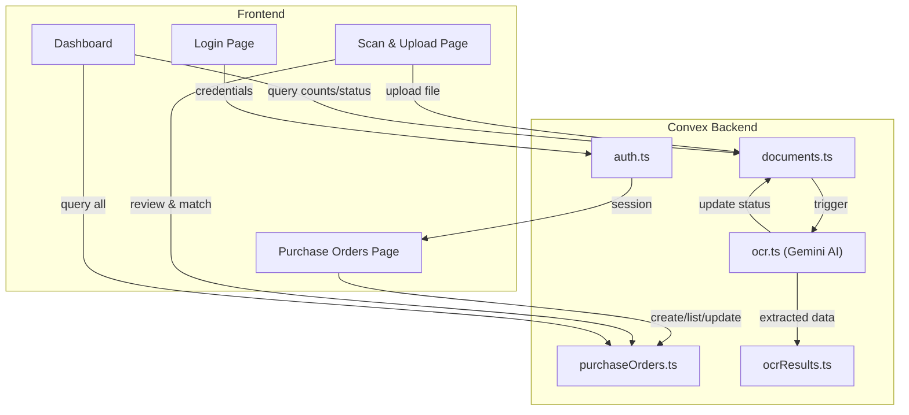

# NeatPO

Turn massive logistics paperwork into organized digital supply chain data.

NeatPO is a purchase order management platform with built-in OCR document scanning. Upload logistics documents, extract data automatically using AI, and match them to purchase orders — all from a single dashboard.

## Workflow

1. **Login** — Authenticate with email and password
2. **Create Purchase Orders** — Add structured POs with supplier, items, dates, and tracking info
3. **Scan & Upload Documents** — Drag-and-drop, file picker, or camera capture for logistics documents
4. **OCR Extraction** — Gemini AI automatically extracts document type, PO#, vendor, items, tracking numbers, dates, amounts, and more
5. **Match to Purchase Order** — Auto-match by PO number or tracking number, with manual match as a fallback
6. **Auto-Fill PO Fields** — Extracted data populates the linked purchase order
7. **Dashboard** — View organized supply chain data with KPI cards, processing status, PO listings, and activity feed

## Architecture



## Tech Stack

- **Framework**: Next.js 16 (App Router)
- **Language**: TypeScript
- **Backend**: Convex (database, real-time data, server functions)
- **OCR**: Google Gemini 2.0 Flash
- **UI**: shadcn/ui + TailwindCSS 4
- **State**: Jotai (client) + TanStack Query (server)
- **Forms**: React Hook Form + Zod
- **Testing**: Vitest + Testing Library

## Getting Started

### Prerequisites

- Node.js 18+
- A [Convex](https://www.convex.dev/) account
- A [Google AI Studio](https://aistudio.google.com/) API key (for Gemini OCR)

### Installation

```bash
npm install
```

### Development

Start the Next.js dev server and Convex in separate terminals:

```bash
npm run dev
```

```bash
npx convex dev
```

Open [http://localhost:3000](http://localhost:3000) to access the app.

### Environment Variables

Set `GEMINI_API_KEY` in your Convex environment variables for OCR processing.

## Project Structure

```
src/
├── app/                    # Next.js App Router pages
│   ├── (dashboard)/        # Authenticated routes
│   │   ├── purchase-orders/
│   │   ├── scan/
│   │   ├── documents/
│   │   └── page.tsx        # Dashboard
│   └── login/
├── features/               # Feature modules
│   ├── auth/               # Authentication
│   ├── purchase-orders/    # PO management
│   ├── documents/          # Document scanning & OCR
│   └── dashboard/          # Dashboard widgets
├── components/             # Shared UI components
└── lib/                    # Utilities

convex/
├── schema.ts               # Database schema
├── auth.ts                 # Authentication
├── purchaseOrders.ts       # PO CRUD
├── documents.ts            # Document management
├── ocr.ts                  # Gemini OCR processing
└── ocrResults.ts           # OCR results storage
```
